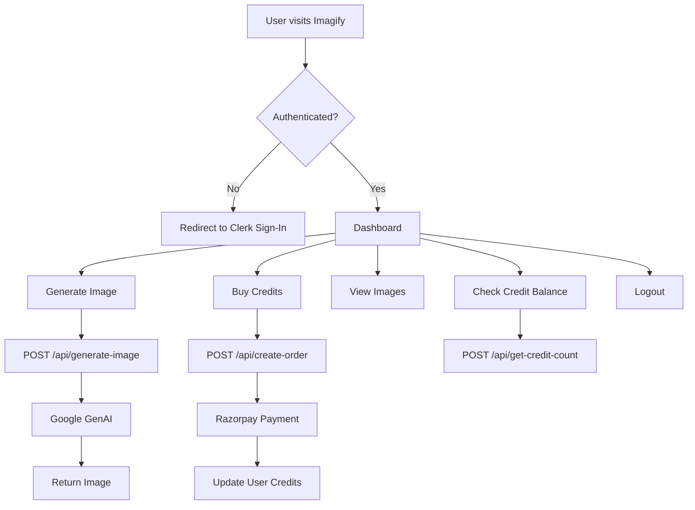

# Imagify SaaS App

Imagify is a modern SaaS application built with Next.js, providing advanced AI-powered image generation and management. It features secure authentication, payment integration, and a robust user experience.

---

## Table of Contents

- [Features](#features)
- [Tech Stack](#tech-stack)
- [Directory Structure](#directory-structure)
- [Authentication Flow](#authentication-flow)
- [API Endpoints](#api-endpoints)
- [Database Models](#database-models)
- [Setup & Installation](#setup--installation)
- [Environment Variables](#environment-variables)
- [Usage](#usage)
- [Deployment](#deployment)
- [Project Flow Diagram](#project-flow-diagram)
- [Troubleshooting](#troubleshooting)
- [Contributing](#contributing)
- [License](#license)
- [Acknowledgements](#acknowledgements)

---

## Features

- **User Authentication:** Secure, scalable authentication using Clerk.
- **AI-Powered Image Generation:** Generate unique images using Google GenAI.
- **Image Management:** Upload, view, and manage generated images.
- **Payment Integration:** Buy credits securely with Razorpay.
- **Responsive UI:** Built with Tailwind CSS and Radix UI for a seamless experience across devices.
- **Notifications:** Real-time feedback with toast notifications and loading spinners.
- **Credit System:** Users spend credits to generate images; credits can be purchased.
- **Robust API:** Modular API endpoints for user, image, and payment management.
- **Extensible Architecture:** Easily add new features or integrations.

---

## Tech Stack

- **Frontend:** React 19, Next.js 15 (App Router, Turbopack)
- **Styling:** Tailwind CSS, tw-animate-css, Radix UI
- **Authentication:** Clerk
- **Database:** MongoDB, Mongoose
- **Payments:** Razorpay
- **AI Integration:** Google GenAI
- **Utilities:** clsx, class-variance-authority, react-hot-toast, react-spinners

---

## Directory Structure

```
.
├── app/
│   ├── api/
│   │   ├── create-order/route.js         # Razorpay order creation
│   │   ├── create-user/route.js          # User registration
│   │   ├── generate-image/route.js       # AI image generation
│   │   └── get-credit-count/route.js     # User credit retrieval
│   ├── sign-in/[[...sign-in]]/page.jsx   # Clerk sign-in page
│   ├── favicon.ico, globals.css, layout.js, page.js
├── components/
│   ├── AlertButton.jsx
│   ├── ImageComponent.jsx
│   ├── Loader.jsx
│   ├── Navbar.jsx
│   └── ui/
│       ├── alert-dialog.jsx
│       ├── button.jsx
│       └── textarea.jsx
├── lib/
│   └── utils.js
├── utils/
│   ├── db/mongodb.js                     # MongoDB connection
│   └── models/user.model.js              # User schema/model
├── public/                               # Static assets
├── package.json, README.md, next.config.mjs, etc.
```

**Key Folders:**

- `app/`: Next.js app directory, including API routes and pages.
- `components/`: Reusable UI components.
- `lib/`: Utility functions.
- `utils/`: Database and model definitions.
- `public/`: Static assets.

---

## Authentication Flow

- **Provider:** Clerk is used for authentication, supporting email/password and social logins.
- **Sign-In:** Users are redirected to `/app/sign-in/[[...sign-in]]/page.jsx` if not authenticated.
- **User Creation:** On first sign-in, `/app/api/create-user/route.js` registers the user in MongoDB.
- **Session Management:** Clerk manages sessions and tokens.
- **Access Control:** Only authenticated users can generate images or purchase credits.

---

## API Endpoints

| Endpoint                | Method | Description                      | Auth Required |
| ----------------------- | ------ | -------------------------------- | ------------- |
| `/api/create-user`      | POST   | Registers a new user             | No            |
| `/api/generate-image`   | POST   | Generates an image using GenAI   | Yes           |
| `/api/create-order`     | POST   | Creates a Razorpay payment order | Yes           |
| `/api/get-credit-count` | POST   | Retrieves user's credit balance  | Yes           |

**Example Request:**

```bash
curl -X POST http://localhost:3000/api/generate-image \
  -H "Authorization: Bearer <token>" \
  -d '{"prompt": "A futuristic cityscape at sunset"}'
```

---

## Database Models

- **User Model:** (`utils/models/user.model.js`)
  - **Fields:**
    - `name` (String): User's display name.
    - `email` (String, unique): User's email address.
    - `token` (Number): Credit balance.
    - _Additional fields can be added as needed._
- **MongoDB Connection:** (`utils/db/mongodb.js`)
  - Handles connection pooling, error management, and reconnection logic.

---

## Setup & Installation

### Prerequisites

- Node.js v18+ and npm
- MongoDB Atlas account or local MongoDB instance
- Clerk account (for authentication)
- Razorpay account (for payments)
- Google GenAI API credentials

### Steps

1. **Clone the repository:**
   ```bash
   git clone https://github.com/yourusername/imagify.git
   cd imagify
   ```
2. **Install dependencies:**
   ```bash
   npm install
   ```
3. **Configure environment variables:**  
   See [Environment Variables](#environment-variables).
4. **Run the development server:**
   ```bash
   npm run dev
   ```
   Open [http://localhost:3000](http://localhost:3000) to view the app.

---

## Environment Variables

Create a `.env.local` file in the root directory and add the following:

```env
MONGODB_URI=mongodb+srv://<user>:<password>@cluster.mongodb.net/imagify
CLERK_SECRET_KEY=your-clerk-secret-key
CLERK_PUBLISHABLE_KEY=your-clerk-publishable-key
RAZORPAY_KEY_ID=your-razorpay-key-id
RAZORPAY_KEY_SECRET=your-razorpay-key-secret
GENAI_API_KEY=your-google-genai-api-key
NEXT_PUBLIC_BASE_URL=http://localhost:3000
```

**Note:** Never commit `.env.local` to version control.

---

## Usage

- **Sign Up / Sign In:**  
  Visit `/sign-in` to create an account or log in.
- **Generate Images:**  
  Enter a prompt and generate images using your available credits.
- **Buy Credits:**  
  Use the "Buy Credits" button to purchase more credits via Razorpay.
- **View Images:**  
  Access your generated images from the dashboard.
- **Check Credit Balance:**  
  Your current credit balance is displayed in the navbar.

---

## Deployment

To deploy Imagify to Vercel:

1. Push your code to GitHub.
2. Connect your repository to [Vercel](https://vercel.com/).
3. Set the required environment variables in the Vercel dashboard.
4. Deploy!

**Other Hosting Options:**  
You can also deploy to platforms like Netlify, AWS, or DigitalOcean. Ensure environment variables are set accordingly.

---

## Project Flow Diagram



---

## Troubleshooting

- **MongoDB Connection Errors:**  
  Ensure your `MONGODB_URI` is correct and your IP is whitelisted.
- **Clerk Authentication Issues:**  
  Verify Clerk keys and application settings.
- **Razorpay Payment Failures:**  
  Check Razorpay credentials and webhook configuration.
- **GenAI API Errors:**  
  Confirm your API key and quota.
- **Build/Runtime Errors:**  
  Run `npm run lint` and `npm run build` to check for issues.

---

## Contributing

Contributions are welcome! Please open issues and pull requests for improvements or bug fixes.

**How to Contribute:**

1. Fork the repository.
2. Create a new branch (`git checkout -b feature/your-feature`).
3. Commit your changes.
4. Push to your fork and submit a pull request.

---

## License

This project is licensed under the MIT License. See [LICENSE](LICENSE) for details.

---

## Acknowledgements

- [Next.js](https://nextjs.org/)
- [Clerk](https://clerk.com/)
- [Razorpay](https://razorpay.com/)
- [Google GenAI](https://ai.google/)
- [Tailwind CSS](https://tailwindcss.com/)
- [Radix UI](https://www.radix-ui.com/)
- All contributors and open-source libraries used in this project.

---
